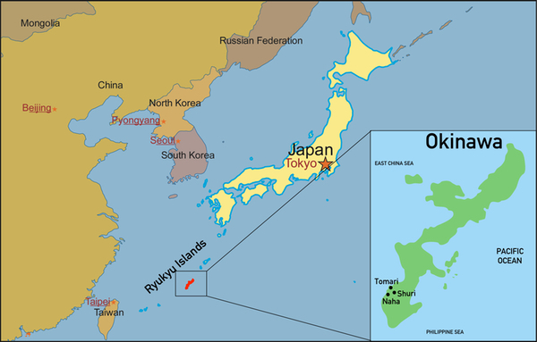

## About Me
* I was born and raised in Okinawa, Japan's southermost prefecture. (for 18 years)

<figure style="text-align:center; margin:0;">
  
  <figcaption style="margin-top:8px; font-size:0.9em; color:#555;">
    Location of Okinawa Islands. Taken from pelletierskarate.com.
  </figcaption>
</figure>
<figure style="text-align:center; margin:0;">
  
  <figcaption style="margin-top:8px; font-size:0.9em; color:#555;">
    A beautiful view of Okinawa.
  </figcaption>
</figure>

 
### Hobby
* Reading novels and manga 
* Watching movies 
     * I love Sci-Fi, Thriller, Action films.
     * I especially like [Christopher Nolan](https://www.imdb.com/name/nm0634240/)'s and [Jordan Peele](https://www.imdb.com/name/nm1443502/)'s flims.
* Listening to K-pop

### Sports
* Karate (2017-2021)
* Savate (French kickboxing, 2021-2025)  
